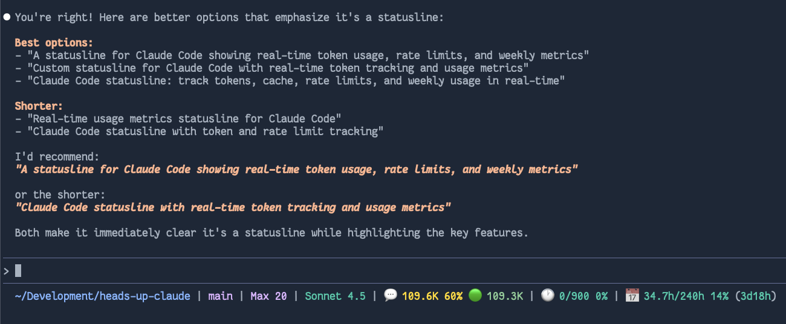

# Heads Up Claude

A custom statusline for Claude Code that displays real-time token usage, rate limits, and weekly usage metrics.



## Features

- **Token Usage Tracking**: Real-time conversation context size with cache read tokens
- **5-Hour Rate Limit**: Message count tracking with time until reset
- **Weekly Usage**: Hours used vs weekly minimum with time until reset
- **Plan Support**: Auto-detection and manual configuration for Pro, Max 5, and Max 20 plans
- **Customizable Display**: Choose between emoji icons or descriptive text
- **Interactive Installer**: Easy setup with auto-detection of your plan and reset time

## Installation

```bash
git clone https://github.com/axiomantic/heads-up-claude.git
cd heads-up-claude
nimble install
```

The installer will help you configure your `~/.claude/settings.json` with the appropriate plan, reset time, and display style.

## Understanding the Statusline

The statusline displays several key metrics to help you manage your Claude Code usage:

```
~/Development/project | feature-branch | Max 20 | Sonnet 4.5 | 💬 104.6K 65% 🟢 104.0K cached | 🕐 178/900 19% (3h22m) | 📅 19.3h/240h 8% (5d23h)
```

### Components

- **Project Directory** (blue): Current working directory
- **Git Branch** (magenta): Active git branch if in a repository
- **Plan Tier** (magenta): Your Claude plan (Pro, Max 5, or Max 20)
- **Model** (cyan): Current model (🧠 emoji appears if thinking mode is enabled)

### 💬 Conversation Context (Session Tokens)

Shows the current conversation's token count and percentage of the auto-compact threshold (default: 160K tokens).

- Tracks actual context size from most recent API call
- Includes cache read tokens + new tokens from last exchange
- Color-coded warnings:
  - Yellow (normal)
  - Red (≥80%)
  - Bright red with ⚠️ (≥90%)
- Resets to zero after `/clear` or reduces after `/compact`

**Example**: `💬 104.6K 65%` means 104,600 tokens used (65% of 160K threshold)

### 🕐 5-Hour Rate Limit

Claude enforces message limits per rolling 5-hour window. This shows your current usage:

- Counts messages in active 5-hour windows
- Each window starts at a rounded hour and expires 5 hours later
- Shows: `current messages / plan limit percentage (time until reset)`
- **Plan Limits**:
  - Pro: 45 messages per 5 hours
  - Max 5: 225 messages per 5 hours
  - Max 20: 900 messages per 5 hours

**Example**: `🕐 178/900 19% (3h22m)` means 178 messages used out of 900 allowed, with 3 hours 22 minutes until the window expires.

### 📅 Weekly Usage

Claude tracks weekly usage hours (session duration, not wall clock time). This shows progress toward your weekly minimum:

- Calculates total session duration (last message time - first message time) for all sessions this week
- Resets at your configured time (default: Wednesday 6pm Central)
- Shows: `hours used / weekly minimum percentage (time until reset)`
- **Plan Limits**:
  - Pro: 40-80 hours/week
  - Max 5: 140-280 hours/week
  - Max 20: 240-480 hours/week

**Example**: `📅 19.3h/240h 8% (5d23h)` means 19.3 hours used out of 240 hour minimum, with 5 days 23 hours until weekly reset.

## Configuration

### Command Line Options

- `--plan=<pro|max5|max20>` - Specify plan tier
- `--reset-time=<ISO datetime>` - Set weekly reset time (e.g., "2025-10-30T18:00:00-05:00")
- `--no-emoji` - Use text labels (CTX, 5HR, WK) instead of emoji
- `--help` - Show help message
- `--install` - Run interactive installer

### Manual Configuration

Edit `~/.claude/settings.json`:

```json
{
  "statusLine": {
    "type": "command",
    "command": "~/.claude/heads-up-claude --plan=max20 --reset-time=\"2025-10-30T23:00:00+00:00\""
  }
}
```

Find your reset time at https://claude.ai/settings/usage

## Development

### Building from Source

```bash
nimble build    # Release build
nimble dev      # Debug build
```

### Project Structure

```
heads-up-claude/
├── src/
│   ├── heads_up_claude.nim    # Main entry point
│   ├── types.nim              # Type definitions
│   ├── cache.nim              # File caching system
│   ├── usage.nim              # Usage calculation
│   ├── display.nim            # Statusline formatting
│   ├── installer.nim          # Interactive installer
│   └── nim.cfg                # Compiler config
├── bin/                       # Build output (gitignored)
├── heads_up_claude.nimble     # Package definition
├── README.md
├── CHANGELOG.md
└── LICENSE
```

### Running Tests

```bash
nimble test
```

## Contributing

Contributions are welcome! Please feel free to submit a Pull Request.

## License

MIT License - see [LICENSE](LICENSE) for details.

## Version

Current version: **0.1.0** (2025-10-24)

See [CHANGELOG.md](CHANGELOG.md) for version history.
